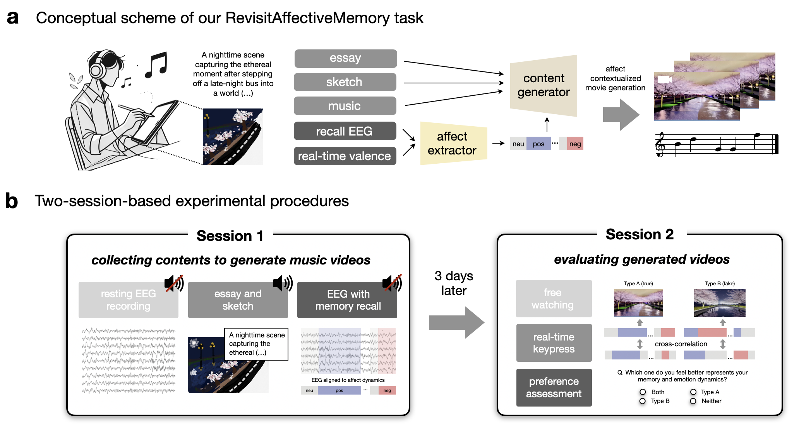
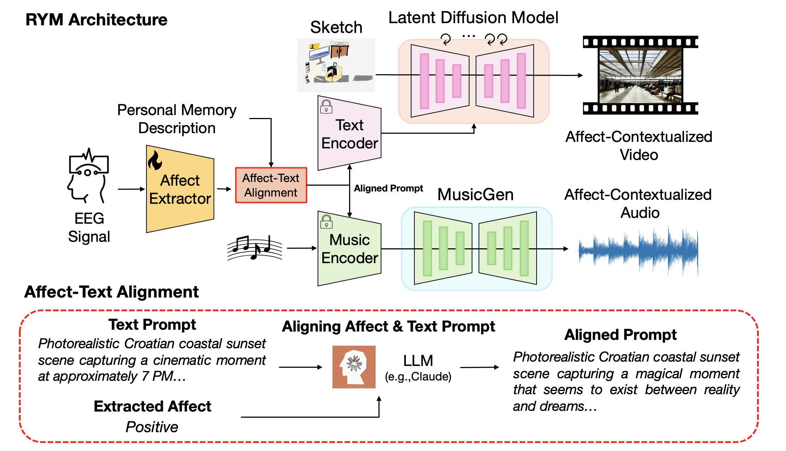
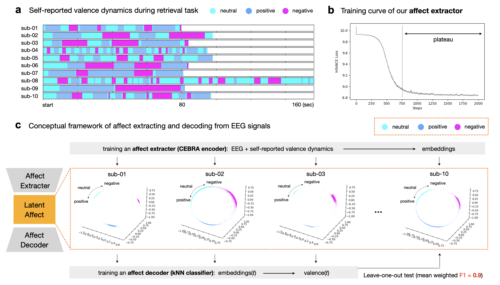
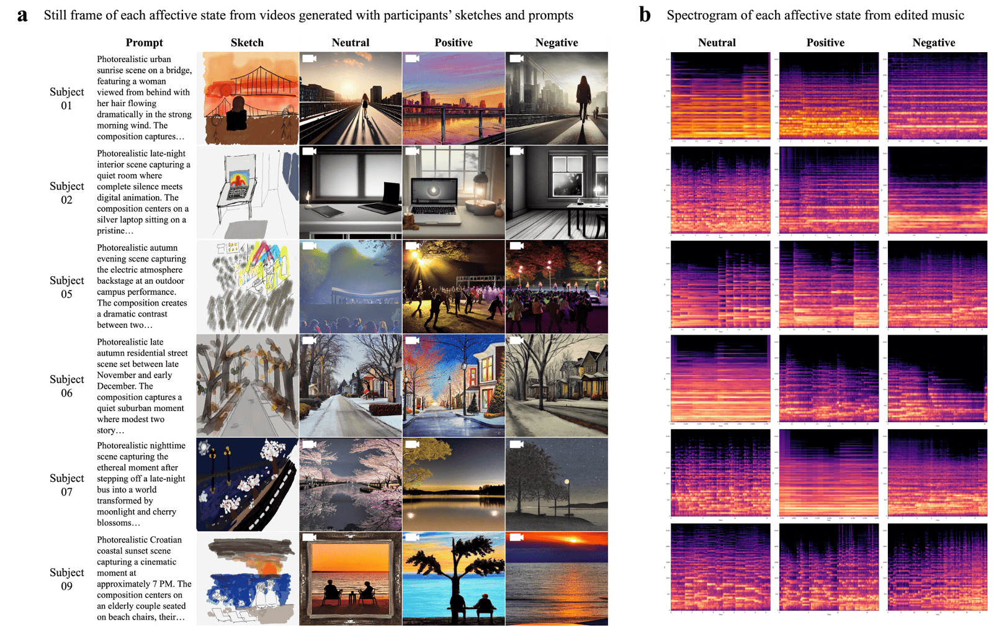
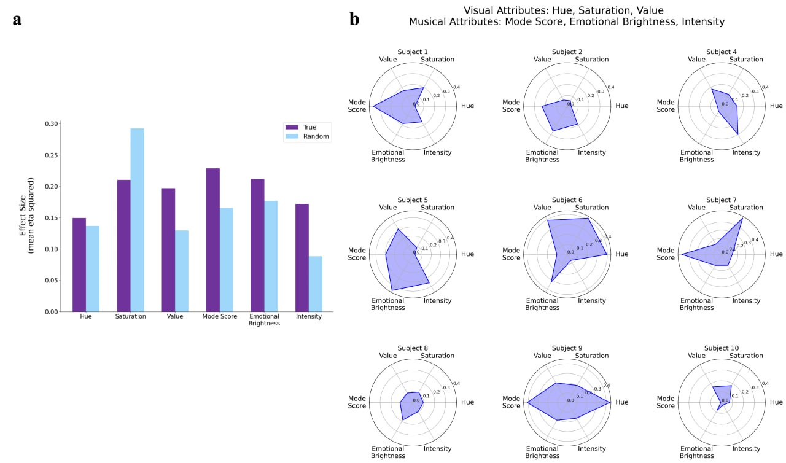

# Revisiting Your Memory: Reconstruction of Affect-Contextualized Memory via EEG-guided Audiovisual Generation (ACM MM'25 CogMAEC-W Oral)
**Official repository** for the paper "Revisiting Your Memory: Reconstruction of Affect-Contextualized Memory via EEG-guided Audiovisual Generation (RYM)". This repository provides the **RYM** demo code and the **EEG-AffectiveMemory dataset**.


<!-- - Project page: [The Official Website for RYM.](https://aesfa-nst.github.io/AesFA/) -->
- arXiv preprint: <https://arxiv.org/abs/2412.05296>
<br></br>



<u>Correspondence to (first authors) :</u>
- Joonwoo Kwon (kwonjoon@msu.edu)<br/>
- Sooyoung Kim (sooyoung.k@rutgers.edu) <br/>
- Heehwan Wang (dhkdgmlghks@snu.ac.kr) <br/>
- Jinwoo Lee (adem1997@snu.ac.kr)

<u>Comments</u>
- The pre-trained Affect Extractor (.pt) can be found in the `CEBRA` folder.
- For affect–text alignment, we used **Claude 3.5 Sonnet** with pre-defined emotion words (see Section 4.3 of the paper).
- For image generation, we used **Stable Diffusion v1.5** (text encoder and LDM). For music generation, we followed the **MusicGEN-melody** framework and pipeline.


## EEG-AffectiveMemory Dataset
- **Aligning affect with text**
  - We employed prompt engineering with LLMs when aligning affect with text.
  - **Sample Prompt:**  
    `"Translate and refine a text description into a proper prompt for an image/music model. In particular, ensure the style of the image/music reflects the feeling of {words}."`
  - You are free to use your own prompt engineering strategy and/or different LLMs for affect–text alignment.

- **EEG signals during memory recall**
  - The main preprocessed EEG signals we used are located at:  
    `./EEG_AffectiveMemory_dataset/sub-{id}/cebra_input`
  - The corresponding raw data can also be found in:  
    `./EEG_AffectiveMemory_dataset/sub-{id}`

- **Sketch paintings**
  - Sketch images for all subjects are available at:  
    `./EEG_AffectiveMemory_dataset/sub-{id}/sub-{id}-sketch.png`
  - To generate video, run the `./image_video_decoding.ipynb` notebook.

- **Associated musical pieces**
  - Due to copyright restrictions, the associated musical pieces are not included directly.  
    Instead, we provide their titles and the corresponding links in:  
    `./EEG_AffectiveMemory_dataset/sub-{id}/sub-{id}-text.txt`
  - To generate music, first place your music file at `./EEG_AffectiveMemory_dataset/sub-{id}/sub-{id}-melody.wav`, then run the `music_generation.ipynb` notebook.

## Abstract
In this paper, we introduce **RevisitAffectiveMemory**, a novel task designed to reconstruct autobiographical memories through audio-visual generation guided by affect extracted from electroencephalogram (EEG) signals. To support this pioneering task, we present the **EEG-AffectiveMemory** dataset, which encompasses textual descriptions, visuals, music, and EEG recordings collected during memory recall from nine participants. Furthermore, we propose **RYM** (**R**evisit **Y**our **M**emory), a three-stage framework for generating synchronized audio-visual contents while maintaining dynamic personal memory affect trajectories. Experimental results demonstrate our method successfully decodes individual affect dynamics trajectories from neural signals during memory recall (F1=0.9). Also, our approach faithfully reconstructs affect-contextualized audio-visual memory across all subjects, both qualitatively and quantitatively, with participants reporting strong affective concordance between their recalled memories and the generated content. Especially, contents generated from subject-reported affect dynamics showed higher correlation with participants' reported affect dynamics trajectories (r=0.265, p<.05) and received stronger user preference (preference=56%) compared to those generated from randomly reordered affect dynamics. Our approaches advance affect decoding research and its practical applications in personalized media creation via neural-based affect comprehension.

## Methods



## Results





## Citation

If you find our paper, code, or dataset useful for your research, please consider citing our work:


```bibtex
@inproceedings{kwon2025revisiting,
  title={Revisiting Your Memory: Reconstruction of Affect-Contextualized Memory via EEG-guided Audiovisual Generation},
  author={Kwon, Joonwoo and Wang, Heehwan and Lee, Jinwoo and Kim, Sooyoung and Yoo, Shinjae and Lin, Yuewei and Cha, Jiook},
  booktitle={Proceedings of the 1st International Workshop on Cognition-oriented Multimodal Affective and Empathetic Computing},
  pages={1--10},
  year={2025}
}
```
